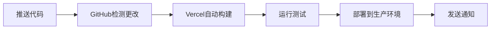

# Text-Shaped Image Merge App

A modern web application that automatically arranges your images into text shapes. Built with Next.js, React, and Canvas technologies.

## ✨ Features

- **Text-Shaped Image Arrangement**: Upload multiple images and arrange them into any text or word shape
- **Real-time Canvas Editor**: Interactive canvas with drag-and-drop functionality
- **Modern UI**: Built with Shadcn UI components and Tailwind CSS
- **Responsive Design**: Works seamlessly on desktop and mobile devices
- **High-Quality Export**: Download your creations as high-resolution images
- **Multiple Use Cases**: Perfect for social media content, photo memories, name art, and creative projects
- **AI-Powered Suggestions**: Get design recommendations powered by AI (requires API key)

## 🎯 Use Cases

- **Social Media Content**: Create eye-catching posts with words like "SALE", "NEW", or brand names
- **Photo Memories**: Turn vacation or family photos into meaningful words like "LOVE", "HOME", or special dates
- **Name Art**: Create personalized gifts using someone's photos to spell out their name
- **Creative Projects**: Design unique compositions for presentations, portfolios, or artistic endeavors

## 🚀 Getting Started

1. **Clone the repository**
   ```bash
   git clone https://github.com/yourusername/text-shaped-image-merge.git
   cd text-shaped-image-merge
   ```

2. **Install dependencies**
   ```bash
   npm install
   # or
   yarn install
   # or
   pnpm install
   # or
   bun install
   ```

3. **Set up environment variables**
   ```bash
   # Copy the example environment file
   cp .env.example .env.local
   
   # Edit .env.local and add your API keys
   # For AI features, you'll need an OpenRouter API key from https://openrouter.ai/
   ```
   
   Required environment variables:
   ```env
   OPENROUTER_API_KEY=your_openrouter_api_key_here
   OPENROUTER_BASE_URL=https://openrouter.ai/api/v1
   OPENROUTER_MODEL=deepseek/deepseek-chat-v3-0324:free
   ```
   
   > **Note**: AI features are optional. The app will work without API keys but won't provide AI design suggestions.

4. **Run the development server**
   ```bash
   npm run dev
   # or
   yarn dev
   # or
   pnpm dev
   # or
   bun dev
   ```

5. **Open in browser**
   Navigate to [http://localhost:3000](http://localhost:3000) to see the application.

## 🛠️ Tech Stack

- **Framework**: Next.js 15 with App Router
- **Language**: TypeScript
- **Styling**: Tailwind CSS
- **UI Components**: Shadcn UI + Radix UI
- **Canvas Libraries**: Fabric.js + Konva + React Konva
- **Icons**: Lucide React
- **AI Integration**: OpenRouter API (DeepSeek model)
- **Code Quality**: Biome (linting & formatting)
- **Package Manager**: Supports npm, yarn, pnpm, and bun

## 📁 Project Structure

```
src/
├── app/                    # Next.js App Router pages
│   ├── api/               # API routes (server-side)
│   │   └── ai-suggestions/ # AI design suggestions endpoint
│   ├── layout.tsx         # Root layout
│   └── page.tsx           # Home page
├── components/            # React components
│   ├── ui/               # Shadcn UI components
│   ├── CanvasEditor.tsx  # Canvas editing functionality
│   ├── ImageMergeApp.tsx # Main application component
│   └── ...
└── lib/                  # Utility functions and configurations
    ├── ai-service.ts     # AI service client
    └── utils.ts          # Utility functions
```

## 🎨 How It Works

1. **Upload Images**: Drag and drop or select multiple images
2. **Enter Text**: Type any word or phrase you want to create
3. **Automatic Arrangement**: The app automatically arranges your images into the text shape
4. **AI Assistance**: Get design suggestions and font recommendations (optional)
5. **Customize**: Fine-tune positioning, sizing, and spacing
6. **Export**: Download your creation as a high-quality image

## 🔧 Development

- **Linting**: `npm run lint` - Runs Biome linter and TypeScript checks
- **Formatting**: `npm run format` - Formats code with Biome
- **Building**: `npm run build` - Creates production build
- **Starting**: `npm run start` - Runs production server

## 📝 Scripts

- `dev`: Start development server with Turbopack
- `build`: Build for production
- `start`: Start production server
- `lint`: Run linting and type checking
- `format`: Format code

## 🌐 Deployment

### Vercel (推荐) - 自动部署已配置 ✅

这个项目已经完全配置好了Vercel自动部署：

#### 🚀 快速部署步骤

1. **Fork并连接仓库**
   - Fork这个GitHub仓库到你的账户
   - 访问 [Vercel官网](https://vercel.com) 并登录
   - 点击 "New Project" 并选择你fork的仓库
   - Vercel会自动检测Next.js配置

2. **设置环境变量**
   在Vercel项目设置中添加：
   ```env
   OPENROUTER_API_KEY=你的API密钥
   OPENROUTER_BASE_URL=https://openrouter.ai/api/v1
   OPENROUTER_MODEL=deepseek/deepseek-chat-v3-0324:free
   ```

3. **自动部署特性**
   - ✅ 每次推送到 `main` 分支自动部署到生产环境
   - ✅ Pull Request 自动创建预览部署
   - ✅ 支持回滚和分支部署
   - ✅ 内置CI/CD流程（代码检查、构建、部署）

4. **查看详细指南**
   - 📖 查看 [DEPLOYMENT.md](./DEPLOYMENT.md) 获取完整部署指南
   - 🔧 配置文件：`vercel.json` 和 `.github/workflows/deploy.yml`

#### 🔄 自动部署流程



### 其他部署平台

- **Netlify**: 需要手动配置环境变量
- **Railway**: 支持自动部署
- **AWS/Google Cloud**: 需要容器化配置
- **其他平台**: 任何支持Node.js 18+和Next.js的平台

### 🔑 生产环境变量

确保在部署平台中设置以下环境变量：

```env
# 必需 - AI功能
OPENROUTER_API_KEY=your_production_api_key
OPENROUTER_BASE_URL=https://openrouter.ai/api/v1
OPENROUTER_MODEL=deepseek/deepseek-chat-v3-0324:free

# 可选 - 高级功能
NODE_ENV=production
NEXT_TELEMETRY_DISABLED=1
```

> **⚠️ 重要**: 如果不设置API环境变量，AI建议功能将使用fallback模式，但其他功能正常工作。

## 🔒 Security Notes

- API keys are securely handled on the server side only
- Client-side code never exposes sensitive credentials
- All AI API calls are made through server-side API routes
- Environment variables are properly excluded from client bundles

## 🤝 Contributing

1. Fork the repository
2. Create your feature branch (`git checkout -b feature/amazing-feature`)
3. Set up your environment variables (copy `.env.example` to `.env.local`)
4. Commit your changes (`git commit -m 'Add some amazing feature'`)
5. Push to the branch (`git push origin feature/amazing-feature`)
6. Open a Pull Request

## 📄 License

This project is private and proprietary.

## 🆘 Support

If you encounter any issues or have questions, please open an issue on GitHub.

---

Built with ❤️ using Next.js and modern web technologies.
